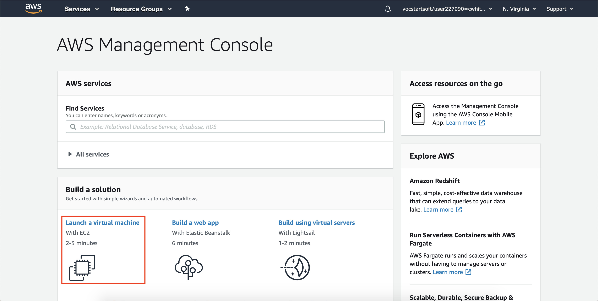
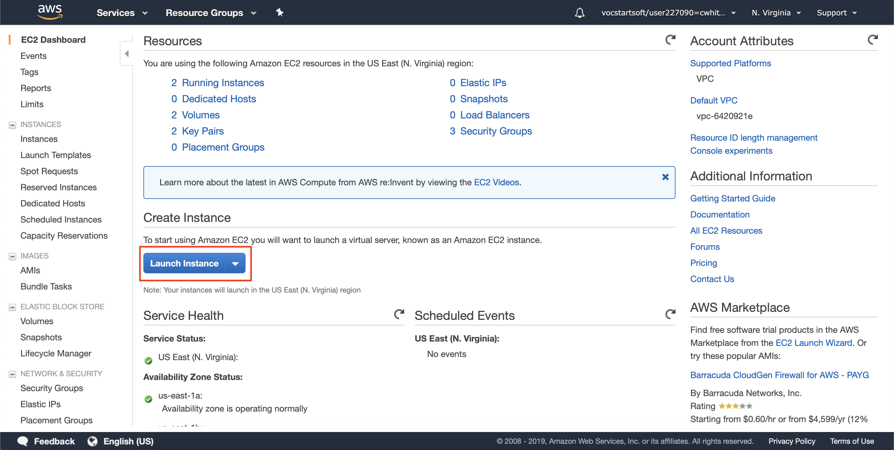
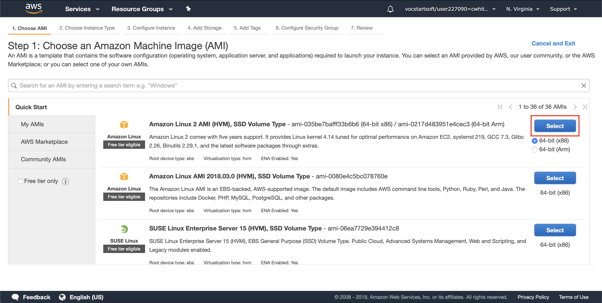
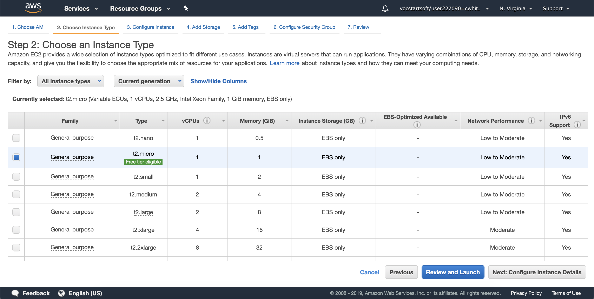
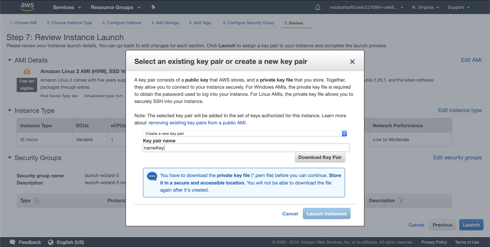
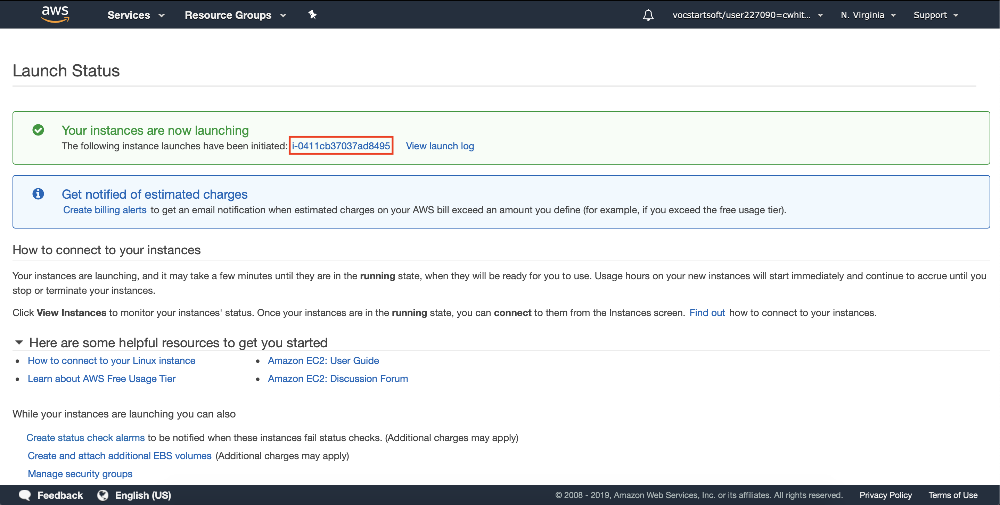
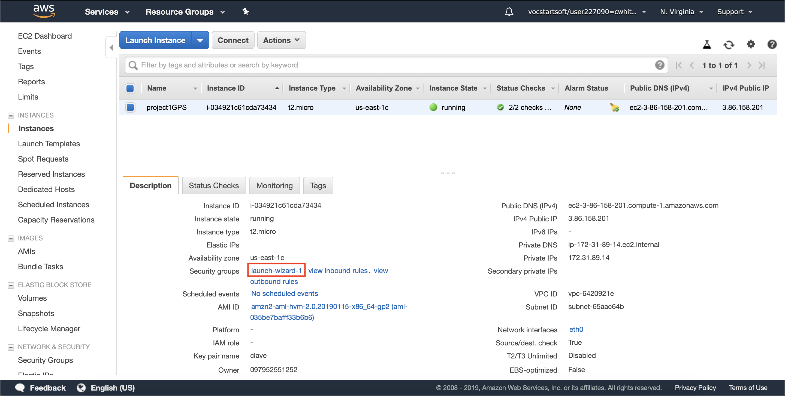
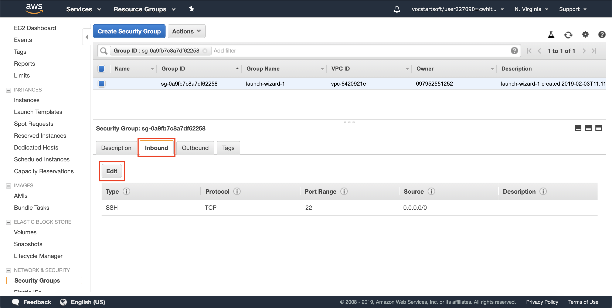
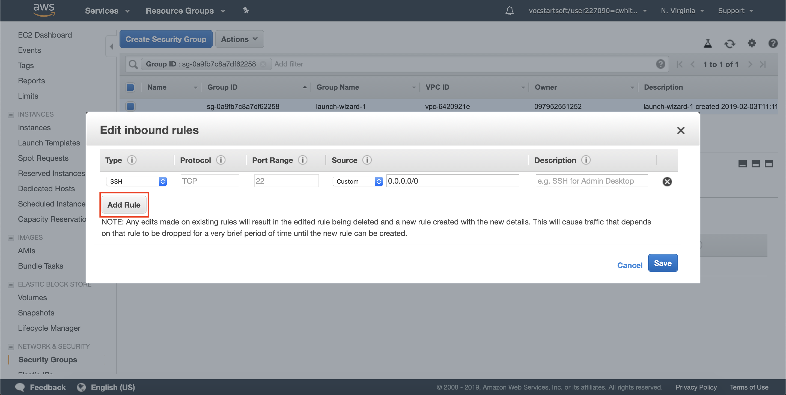
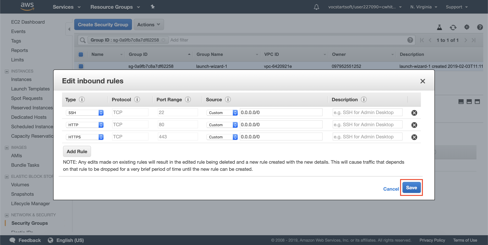

# Documentation of the Project

All the following commands are for Mac.

## Installing NodeJS and MongoDB
```
brew update
brew install node
brew install mongodb
```
To verify is MongoDB was installed, run
```
mongo
```

## Create app
The first step to creating the app, run

```
npm init -y
```

This command creates the **package.json**.

## Installing all dependencies
After having the **package.json** file, run
```
npm install bcryptjs connect-flash express express-handlebars express-session method-override mongoose passport passport-local socket.io
```

## Docker
Download the [Docker graphic installer](https://docs.docker.com/docker-for-mac/install/)

Create the [Dockerfile](Dockerfile), [docker-compose](docker-compose.yml) and [NGINX configuration](nginx.conf)

Clone the repository

```
git clone https://github.com/cwhite98/project1GPS.git
cd project1GPS
```
And then deploy the app with Docker
First create the Docker container
```
docker-compose build
```
Second run de docker container
```
docker-compose up
```
To run the container **detach**
```
docker-compose up -d
```
Check if the app was deployed
```
http://ipserver_or_domain
```
The domain for this app is: https://cwhiter.dis.eafit.edu.co

## Deploy in AWS
- Create an accout in [AWS Educate](https://www.awseducate.com)
- Launch Virtual Machine with EC2

- Select Launch Instance

- Choose Amazon Linux 2 64-bit(x86)

- Select the Free tier and then press Review and Launch.

- Press Launch again.
- Select create a new pair key, give it a name, then Download it and finaly Launch Instance. 

- Select the instance.

- Add the ports 80 and 443.









